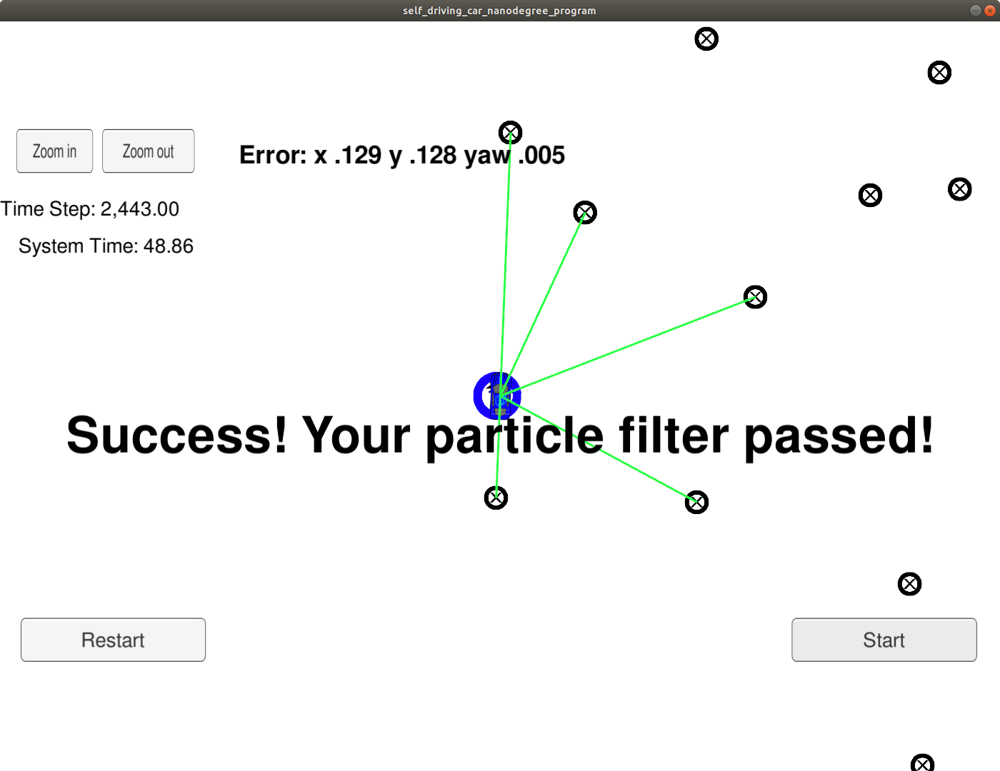

# Overview
This is the repository about my implementation of Particle filter project of `Self Driving Car Nanodegree` programme. 

### Original README
This Readme is updated from the [original readme file](README_original.md)

## Project Introduction
The Project story is, 
```
Your robot has been kidnapped and transported to a new location! Luckily it has a map of this location, a (noisy) GPS estimate of its initial location, and lots of (noisy) sensor and control data.

In this project you will implement a 2 dimensional particle filter in C++. Your particle filter will be given a map and some initial localization information (analogous to what a GPS would provide). At each time step your filter will also get observation and control data.
```

## Running the Code
from the [original readme](README_original.md),
```
... some scripts have been included to streamline this process, these can be leveraged by executing the following in the top directory of the project:

1. ./clean.sh
2. ./build.sh
3. ./run.sh

Tips for setting up your environment can be found [here](https://classroom.udacity.com/nanodegrees/nd013/parts/40f38239-66b6-46ec-ae68-03afd8a601c8/modules/0949fca6-b379-42af-a919-ee50aa304e6a/lessons/f758c44c-5e40-4e01-93b5-1a82aa4e044f/concepts/23d376c7-0195-4276-bdf0-e02f1f3c665d)

```

### Acknowledgements:

I took help from other repositories, to debug my code. So , it is fair to mention them 

- https://github.com/sohonisaurabh/CarND-Kidnapped-Vehicle-Project

- https://github.com/darienmt/CarND-Kidnapped-Vehicle-P3
- https://github.com/syang8/CarND-Kidnapped-Vehicle-Project

